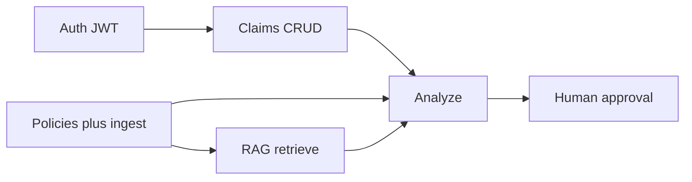

# System design (MVP)

Focus: what this backend actually ships today (“part B” of the D2 claims path), and what it deliberately does not.

## MVP flow



End-to-end product path:

```text
Claim create
  → Policy version from incident date
  → RAG evidence (existing retrieve)
  → Structured AI analysis
  → Deterministic payout in code
  → PENDING approval
  → Admin approve / reject / edit-and-approve
  → Claim APPROVED or REJECTED + audit
```

## Architecture layers

The Nest API stays in four layers under `src/`. There is no `src/claims/` or `src/adjudication/` package tree.

| Layer | Role | Examples |
|---|---|---|
| `domain/` | Entities, ports (abstract classes), pure rules | `Claim`, `ClaimAnalysis`, `Approval`, `selectPolicyVersion`, `calculatePayout` |
| `application/` | Use cases | `ClaimsService`, `RagService`, `AdjudicationService`, `ApprovalsService` |
| `infrastructure/` | TypeORM, JWT, bcrypt, pgvector, OpenAI-compatible client | `*TypeOrmRepository`, `JwtAccessGuard`, `OpenAiClaimAnalyzer` |
| `presentation/` | Controllers, DTOs, feature modules | `ClaimsModule`, `AdjudicationModule`, `ApprovalsModule` |

Feature modules wire ports to adapters. Application services depend on ports, not TypeORM classes.

## What each module owns

### Auth and users

- `POST /auth/login`, `POST /auth/refresh`
- Roles: `admin` | `employee` on table `auth_users`
- Access tokens use `JWT_SECRET`; refresh tokens use `JWT_REFRESH_SECRET` and `typ: refresh`

### Policies and ingestion

- Policy upload (PDF/DOCX), list, options, delete
- One policy **row** is one version: `id`, `version`, `effectiveFrom`, `effectiveTo`
- Rows that share `name` + `language` are a version family
- After upload: `UPLOADED` → background ingest → `INDEXED` or `FAILED`
- Chunks in `policy_chunks`; embeddings in pgvector (`vector(384)`)

### Retrieval

- `POST /rag/retrieve` only
- Dense + keyword → reciprocal-rank fusion → optional term-coverage rerank → evidence threshold
- Returns ranked chunks and citations, or a refusal when evidence is weak
- Does **not** generate a natural-language answer

### Claims

- CRUD-style: create, list, get, patch
- Guarded with `JwtAccessGuard`
- New claims are `SUBMITTED`; client cannot set `status`, `createdBy`, or `claimNumber`
- Admin sees all claims; employee sees only own claims

### Analysis (adjudication)

Implemented in `AdjudicationService` (`POST /claims/:id/analyze`):

1. Load claim and ownership check
2. Resolve applicable policy row: `effectiveFrom <= incidentDate` and (`effectiveTo` null or `>= incidentDate`); zero or many matches → `NO_APPLICABLE_POLICY_VERSION`
3. Four RAG topic searches filtered to that policy id
4. Structured model call (`claim-analysis.v1` prompt)
5. Schema validation; limit/deductible must appear in cited text
6. Payout in code: `min(claimed, limit) - deductible`, floored at 0
7. Persist `ClaimAnalysis`
8. Open a `PENDING` approval (including `INSUFFICIENT_EVIDENCE` / `FAILED`, with recommendation `REVIEW` and reasoning that there is no evidence to support a decision)

### Approvals

- Auto-created by the backend after analysis finishes (no public create-approval body)
- Admin only: list, get, approve, reject, edit-and-approve
- AI `originalRecommendation` snapshot is never overwritten
- Decision + claim status + audit run in one transaction with optimistic `version` checks
- Edited payout must be ≤ `min(claimedAmount, coverageLimit)`

## Data model (simplified)

```text
auth_users ──createdBy──► claims ──policyId──► policies
                              │
                              ├── claim_analyses (policy_version_id → policies.id)
                              │
                              └── approvals ──► approval_audits
```

Schema sync uses TypeORM `synchronize: true`. There is no migrations framework in this repo. The claim-number sequence `claim_number_seq` is raw SQL inside the claims repository.

## Gap table (honest)

| D2 / assignment ask | Status in this MVP |
|---|---|
| Auth, policies, ingest, RAG retrieve | Built |
| Claims CRUD + incident date + policy link | Built |
| Policy version from incident date | Built (policy row = version; no separate `PolicyVersion` table) |
| RAG evidence into claim analysis | Built (reuses `RagService`) |
| Structured AI + schema validation | Built |
| Deterministic limit / deductible / payout | Built in code; AI must not invent numbers |
| Human approve / reject / edit-and-approve + audit | Built (admin = adjuster) |
| Multi-agent orchestrator (coverage matcher, exclusion analyst, drafter, …) | **Not built** |
| Streaming / realtime agent progress | **Not built** |
| T5 reviewer assignment, SLA, escalation, stats | **Not built** |
| Migrations / production schema strategy | **Not used** (`synchronize: true` for local/dev) |
| JWT on users, policies, RAG routes | **Not applied** (claims, analyze, approvals only) |
| Frontend Approvals queue wired to this API | **Out of this repo’s delivery** (front still has in-memory mock) |
| Perfect cross-lingual retrieval | **Partial** — see [EVALUATION.md](./EVALUATION.md) |
| Side-effecting tools behind approval gate | Approval state is authoritative; tools themselves **not built** |

## Key design rules

- AI recommends and explains from supplied evidence.
- Backend calculates and validates money.
- Human decides; system records both AI and human outcomes.
- Prefer refusal / `REVIEW` over inventing coverage or payout when evidence is missing.
